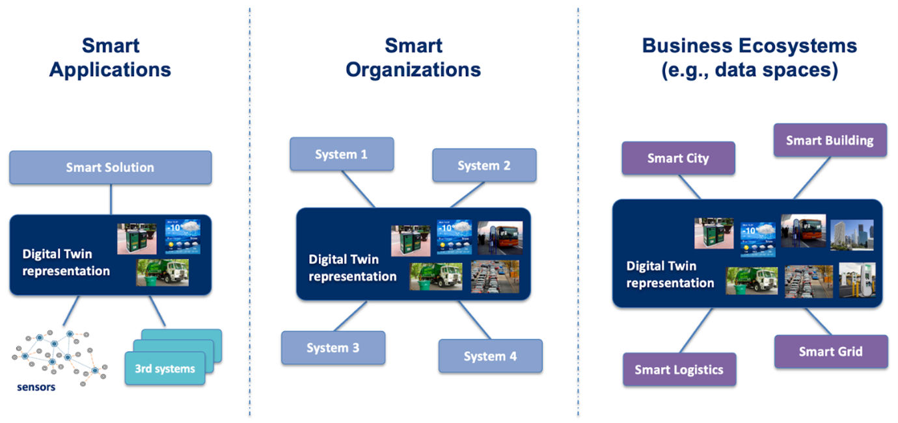
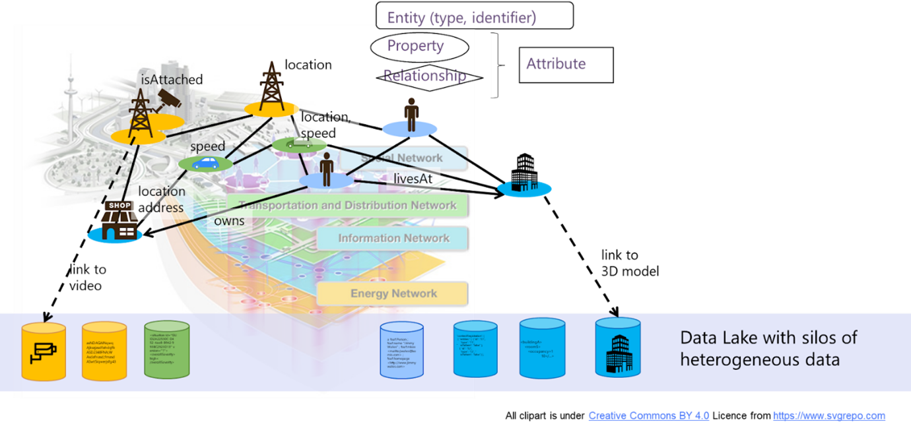
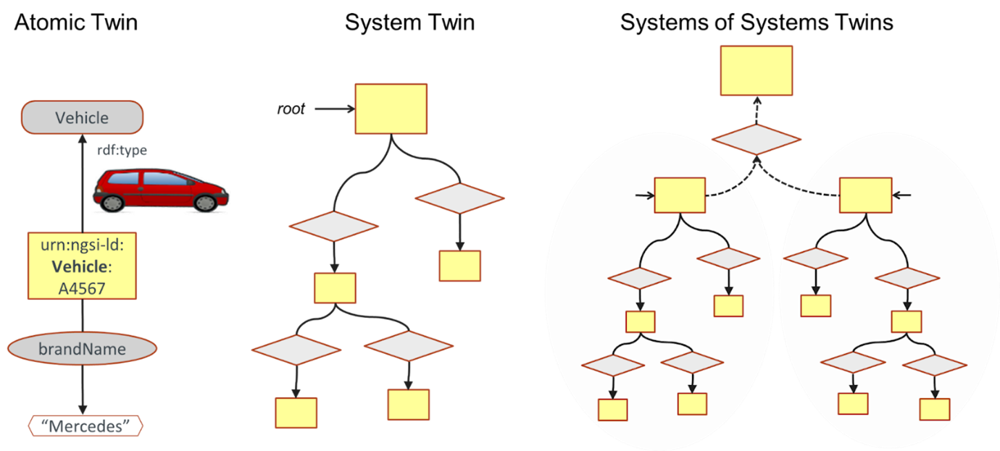
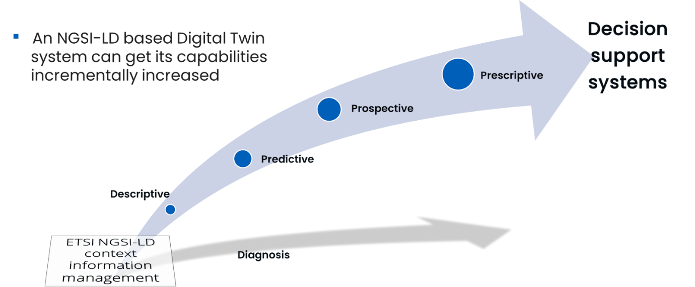

## Overview
This page describes the FIWARE vision and roadmap on Digital Twins, from fundamental concepts to advanced orchestration. It starts with the [digital twin concpet](#digital-twin-concept), followed by the 
[NGSI-LD Information model](#ngsi-ld-information-model-for-modelling-digital-twins) for formally modeling Digital Twins and the [NGSI-LD API](#ngsi-ld-api-for-accessing-digital-twin-information) for standardized
access to their data and context. Next, it covers [Digital Twin Capabilities](#digital-twin-capabilities), including descriptive, predictive, prospective, prescriptive, and diagnostic functions. 
The page then presents [Digital Twin Orchestration using FogFlow](#digital-twin-orchestration-using-fogflow) and outlines a [roadmap](#roadmap) for future developments, including 
[service execution for actuation](#service-execution-for-supporting-actuation-and-instantiation-of-digital-twin-capabilities), 
[snapshots for advanced analytics](#snapshots-for-supporting-predictive-prospective-and-prescriptive-digital-twin-capabilities), and 
[integration with geospatial and building information management systems](#integration-with-geospatial-systems-and-building-information-management). 
It concludes with a [summary of resources](#summary-of-resources) for further reference.

---

## Digital Twin concept

In FIWARE, a Digital Twin is an entity that digitally represents a real‑world physical asset (e.g., a bus in a city, a milling machine in a factory), a concept (e.g., a weather forecast, a product order), or a structured collection of entities (e.g., a building composed of floors, which in turn contain rooms). Each Digital Twin:

- is uniquely identified by a URI (Universal Resource Identifier),
- belongs to a well‑defined type (e.g., _Bus_, _Room_), also identified by a URI, and
- is described through a set of attributes, classified as either:
  - **properties**, which hold data (e.g., the _current speed_ of a bus or the _maximum temperature_ of a room), or
  - **relationships**, which link the entity to other Digital Twins via their URIs (e.g., the _Building_ a specific _Room_ belongs to).

The attributes of a Digital Twin can range from highly static (e.g., the _license plate_ of a bus), to very dynamic (e.g., _speed_ or _number of passengers_), to moderately variable (e.g., the _driver_ of a bus, which may change a few times a day). Crucially, Digital Twins are not limited to observable data — they may also include **inferred or computed information**. For example, the Digital Twin of a street may include a _current traffic_ attribute derived from sensors or cameras, as well as a _traffic forecast for the next 30 minutes_, computed using AI models that take into account current conditions, weather data, events, and historical patterns.

As a result, the Digital Twin–based representation of the world within a “Powered by FIWARE” architecture is expected to contain not only raw, measurable data but also enriched insights and knowledge accumulated over time, providing smart applications with all the contextual information they need.

Digital Twins enable key capabilities: **Descriptive** (current and past states), **Predictive** (future behavior), **Prospective** (“what‑if” analysis), **Prescriptive** (recommended actions), and **Diagnosis** (evaluation of past events, including malfunctions), making them central to interoperable and replicable smart solutions.

The Digital Twin concept is a key abstraction for building systems at multiple levels: from local smart solutions that integrate sensors and third‑party information systems, to organization‑wide system‑of‑systems architectures, and even to cross‑organization data sharing within Data Spaces.

*Figure: Digital Twins – System Perspective*

---

## NGSI-LD information model for modeling Digital Twins

The NGSI-LD information model is built around a property‑graph approach, where the core element is the **Entity**, representing a physical or virtual object. Each Entity is assigned one or more **Entity Types** and is uniquely identified by an **Entity Id**, expressed as a URI. An Entity can have zero or more **attributes**, each identified by a name, and these attributes fall into two main categories: **Properties** and **Relationships**.

**Properties** describe the static or dynamic characteristics of an Entity, including **GeoProperties** that provide its geospatial context. Each Property holds a value, which may be a simple type such as a number, string, or boolean, or a more complex structure such as an array or an object (structured value).

**Relationships** capture associations between Entities and are always unidirectional. A Relationship has an **object**, represented by a URI that identifies the target Entity it points to.

A key aspect of the NGSI‑LD model is its recursive structure: **both Properties and Relationships can themselves have additional Properties and Relationships**. This allows for rich, extensible descriptions and fine‑grained contextualization, enabling NGSI‑LD to represent complex, interconnected digital twins and their evolving states within a property graph.

*Figure: NGSI-LD Information Model*

## Digital Twins: Digital Twin Modeling

The complexity of a Digital Twin depends on what it represents. An **Atomic Twin** can be modeled as a single Entity, a **System Twin** as a graph of interconnected Entities, and a **System‑of‑Systems Twin** as an aggregation of multiple System Twins.

*Figure: Digital Twins: Digital Twin Modeling*

## NGSI-LD compatible Smart Data Models

The NGSI‑LD information model is a meta‑model that represents the world in terms of **Entities**, each identified by an **Entity Id** and associated with one or more **Entity Types**, and enriched through **Properties** and **Relationships**. However, NGSI‑LD itself does not define which specific Entity Types exist or which Properties and Relationships are valid for a given type. These details are defined separately by a **Data Model**, which specifies the structure and semantics of each Entity Type.

The **Smart Data Models initiative**, launched by the FIWARE Foundation, provides a comprehensive library of Data Models designed to be fully compatible with the NGSI-LD information model and API. These Data Models align with [schema.org](https://schema.org) and adhere to existing sector-specific standards whenever such standards are available.

Since its inception, the initiative has published more than 900 Data Models, with a steadily increasing number of organizations contributing new specifications. Major contributors such as [TM Forum](https://www.tmforum.org) and [IUDX](https://www.iudx.org.in) have supported the adoption of an open governance model, ensuring the initiative follows established open-source best practices.

---

## NGSI-LD API for accessing Digital Twin information

The NGSI-LD API offers a set of operations for **managing** and **accessing** Digital Twins. For accessing Digital Twins, it supports retrieving a specific Digital Twin, performing **queries** to discover and retrieve Digital Twins that match specified filter criteria in a single step, and **subscribing** to changes in Digital Twins to receive real-time updates. The NGSI-LD API is implemented by a **Context Broker**. There are different deployment options running from a single, **centralized Context Brokers** to **distributed and federated deployments** with multiple interacting Context Brokers.

*Figure: Retrieving specific Digital Twin "Route B7"*

The example above shows the retrieval of the Digital Twin “Route B7” with all its segments, including their starting points and endpoints. The graph query goes to a depth of 2 and only id, type, hasPart (including startsAt and endsAt) are retrieved.

*Figure: Querying all Digital Twins that have a segment that starts at “Station II”*  

The example above shows the query for all Routes with a filter for those that have a segment that starts at “Station II”. As there is no Projection as in the example above that restricts the attributes to be retrieved, all fitting Entities, again to a depth of 2 are retrieved.

---

## Digital Twin Capabilities

*Figure: Overview of Digital Twin Capabilities*

Digital Twins can provide a range of progressively advanced capabilities that help organizations understand, anticipate, and manage the behavior of real-world assets. The **Descriptive Twin** captures the current and past states of an asset – both static and dynamic – and maintains a bidirectional connection between the real-world object and its digital representation. For example, a city’s Digital Twin may show the _current traffic conditions_ across different streets based on sensor data and historical records.

Building on this, the **Predictive Twin** adds the ability to forecast how the asset is likely to evolve in the future. In the traffic scenario, it could estimate the _traffic situation in 30 minutes_, combining real-time observations with historical patterns of similar conditions.

The **Prospective Twin** further extends these capabilities by enabling “what-if” scenario analysis. For instance, it could simulate _how traffic would be affected if an accident occurred at a specific intersection_, allowing planners to explore alternative future states.

The **Prescriptive Twin** goes one step further by recommending actions based on the insights from the prospective analysis. Using the same example, it might propose _mitigation measures_, such as rerouting vehicles, deploying traffic officers, or adjusting traffic light timing to minimize congestion.

Finally, the **Diagnosis Twin** focuses on understanding past events, particularly malfunctions or anomalies. In the context of traffic management, it could help identify _why a severe congestion event occurred_, analyzing sensor data, system logs, and environmental factors to pinpoint root causes.

Together, these capabilities enable Digital Twins to evolve from simple representations of real-world assets into powerful tools for prediction, decision support, and continuous improvement.

---

## Digital Twin orchestration using FogFlow

FogFlow is an IoT edge–cloud computing framework that orchestrates dynamic data-processing flows in a context-driven manner, considering system resources, data availability, and user-defined QoS. FogFlow can be used to implement both **generic Digital Twin capabilities** and **application-specific functionalities**, enabling scalable and adaptive solutions.

In a Digital Twin architecture, NGSI-LD Context Brokers maintain the semantic data model by storing entities, attributes, and relationships. They unify heterogeneous datasets and provide flexible discovery mechanisms, allowing FogFlow to access the real-time context necessary for processing.

FogFlow acts as a service-mashup and serverless execution engine. It interprets the high-level intents specified by the Digital Twin developer, discovers the relevant entities through the Context Broker, and generates detailed execution plans that define the required functions, the number of instances, and data flows. Containerized functions are deployed across edge and cloud nodes, retrieving context directly from the broker and following linked data references as needed.

The interaction between FogFlow and Context Brokers is continuous and adaptive. FogFlow depends on the broker for real-time context and subscriptions to updates, while the broker receives new or enriched data produced by FogFlow. As entity states change, FogFlow dynamically triggers, scales, or reconfigures functions. Together, they provide an automated pipeline where the broker maintains the Digital Twin’s knowledge graph, and FogFlow operationalizes it through distributed, context-aware computation.

---

## Roadmap

### Service Execution for supporting Actuation and Instantiation of Digital Twin Capabilities

Current **conventions for triggering simple actuations via the NGSI-LD API update operations**, as currently used by Digital Twin implementations, **have significant limitations**. They rely on all stakeholders strictly following these conventions, and even then, NGSI-LD Context Brokers do not truly understand that an actuation is being requested. Instead, they simply execute an update on a Property, without awareness of the intended service or action. This makes the approach fragile and insufficient for robust Digital Twin applications.

To fully support Digital Twins, **NGSI-LD needs explicit mechanisms for service execution**. These mechanisms will allow services to be executed with a consistent set of parameters, handle concurrent executions (blocking or non-blocking), enforce execution order, support conditional and time-triggered or recurring executions, allow explicit cancellation, enable prioritization with potential pre-emption, and provide clear feedback in case of errors. Such capabilities are essential to ensure reliable, coordinated, and intelligent operation of Digital Twin services. Such service execution mechanisms are currently under development in ETSI. As there are similar mechanisms in the **Web of Things (WoT)**, there are currently ongoing **discussions with W3C to align approaches**, avoiding fragmentation in standards related to Digital Twins.

### Snapshots for supporting predictive, prospective and prescriptive Digital Twin Capabilities

When executing an NGSI-LD query, the number of entities may be too large to return in a single response, requiring **pagination**. In dynamic environments, the data may change between pages, so the values retrieved on later pages are from a later point in time than those on earlier pages, leading to **inconsistent results**, particularly in distributed systems.

To address this, a **snapshot** creates a “frozen” view of the data at the time of the request, making all relevant information locally available. Applications can then use the consistent snapshots as a basis for implementing Digital Twin capabilities, e.g. **what-if analyses**. Snapshots can be dynamically updated to simulate scenarios (e.g., droughts, pollution, heavy rain) and can also be **cloned** to run multiple simulations from the same starting point, ensuring reproducible and reliable results. Snapshots have already been specified in NGSI-LD 1.9, but are yet to be implemented by FIWARE Context Brokers.

### Integration with Geospatial Systems and Building Information Management

While NGSI-LD supports geographic modeling, several limitations must be addressed for digital twin scenarios. To better support geographic modeling, **the following extensions are being recommended** by experts in ETSI. GeoJSON relies solely on WGS84, which is too restrictive for integrating geospatial, BIM, sensor, and CAD data that use different coordinate reference systems. Introducing **an optional _coordRefSys_ subproperty** allows any OGC-compliant CRS to be referenced, ensuring accurate spatial alignment. NGSI-LD also benefits from **supporting multi-scale geometry**: adopting CityGML’s LOD0–LOD4 levels enables assets to be represented consistently from coarse city models to detailed 3D structures.

Further extensions strengthen NGSI-LD’s 3D capabilities. A dedicated **_3DShape_ property** makes it possible to reference complex CAD- or indoor-geometry using WKT for spatial queries and glTF for real-time visualization, complemented by metadata such as zero point, bounding volume, and LOD. **Additional OGC-aligned geo-predicates**—_crosses_, _covers_, _coveredBy_, and _inside_—improve spatial reasoning without adding unnecessary complexity. Together, these enhancements increase NGSI-LD’s precision, interoperability, and suitability as a core framework for advanced digital twins.

---

## Summary of resources

- **NGSI-LD information model for modelling digital twins**  
  - [NGSI-LD INformation Model](https://www.etsi.org/deliver/etsi_gs/CIM/001_099/009/01.03.01_60/gs_cim009v010301p.pdf) Specification
  - [Introduction ot NGSI-LD Digital Twin Modeling\[slides\](https://www.fiware.org/wp-content/uploads/NGSI-LD-Digital-Twin-Modelling.pdf)

- **Smart Data Models (NGSI-LD compatible)**  
  - [Website](https://smartdatamodels.org)
  - [Github](https://github.com/smart-data-models)

- **NGSI-LD API for accessing Digital Twin information**  
  - [NGSI-LD Primer](https://www.etsi.org/deliver/etsi_gs/CIM/001_099/009/01.03.01_60/gs_cim009v010301p.pdf)
  - [NGSI-LD API](https://www.etsi.org/deliver/etsi_gs/CIM/001_099/009/01.03.01_60/gs_cim009v010301p.pdf) Specification
  - [Introduction to NGSI-LD API for Digital Twins](https://www.fiware.org/wp-content/uploads/NGSI-LD-API-for-Digital-Twins.pdf)

- **Digital Twin Capabilities**  
  - [Introduction to Digital Twin Capabilities\[slides\]](https://www.fiware.org/wp-content/uploads/Introduction-to-Digital-Twin-Capabilities.pdf)

- **Roadmap**  
  - Outlook: [Service Execution for supporting Actuation and Instantiation of Digital Twin Capabilities](https://www.etsi.org/deliver/etsi_gs/CIM/001_099/009/01.03.01_60/gs_cim009v010301p.pdf)
  - Outlook: [Usage of geo-information](https://www.etsi.org/deliver/etsi_gs/CIM/001_099/009/01.03.01_60/gs_cim009v010301p.pdf), [Aligning with geo-information](https://www.etsi.org/deliver/etsi_gs/CIM/001_099/009/01.03.01_60/gs_cim009v010301p.pdf), [Using NGSI-LD in the context of Building Information Management (BIM)](https://www.etsi.org/deliver/etsi_gs/CIM/001_099/009/01.03.01_60/gs_cim009v010301p.pdf)

